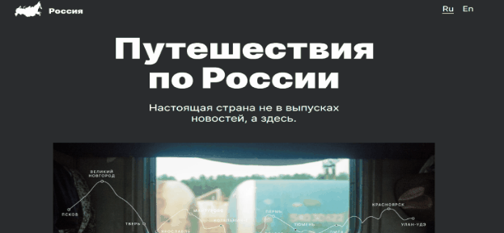

# Проект 3: Путешествие по России  
******************************************  
  
### Проект выполнен в рамках учебного курса Яндекс Практикум  
  
  
************************  
**Описание**  
  
Страница сверстана по макету созданному в Figma * [Ссылка на макет](https://www.figma.com/file/5S2WSbEFL6awjVWJ0NWL8Q/Sprint-3_-Russia-_-desktop-mobile?node-id=28503%3A0)  
  
<big>Проект написан с использованием CSS и HTML.  </big>
<big>Файловая структура создана по БЭМ.  </big>
<big>HTML и CSS написаны, опираясь на БЭМ-методологию.  </big>


**Планы**

* С использование JS добавить анимацию. Сделать страницу интерактивной. 
```
 Сверстал Гагаев Денис. 
 ```